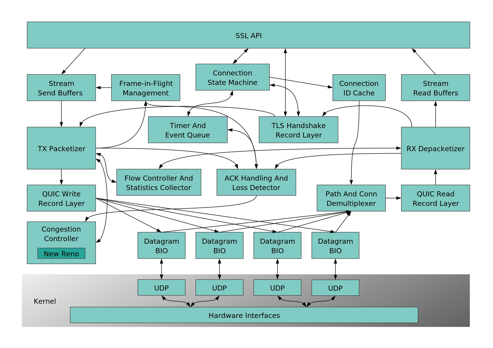

QUIC Design Overview
====================

The QUIC implementation in OpenSSL is roughly described by the following
picture.

SSL API
-------

The application facing public API of the OpenSSL library.

Stream Send and Read Buffers
----------------------------

Buffers for stream data to be sent or received from the peer over the
QUIC protocol. These are necessary to support existing semantics of the
SSL_read and SSL_write functions.

They will be bypassed with a single-copy API for read and write (_not
for MVP_).

Frame in Flight Manager
-----------------------

The frame in flight manager manages the queueing of frames which may need to be
retransmitted if the packets in which they were transmitted were lost. It is
[discussed in more detail here.](quic-fifm.md)

Connection State Machine
------------------------

A state machine handling the state for a QUIC connection.

Connection ID Cache
-------------------

A table matching Connection IDs with Connection objects represented
via SSL objects.

_In MVP there is a many-to-1 matching of Connection IDs to Connection
objects.  Refer third paragraph in [5.1]_

[5.1]: (https://datatracker.ietf.org/doc/html/rfc9000#section-5.1)

Timer And Event Queue
---------------------

Queue of events that need to be handled asynchronously or at a later
time.

TLS Handshake Record Layer
--------------------------

A module that uses the Record Layer API to implement the inner TLS-1.3
protocol handshake. It produces and parses the QUIC CRYPTO frames.

TX Packetizer
-------------

This module creates frames from the application data obtained from
the application. It also receives CRYPTO frames from the TLS Handshake
Record Layer and ACK frames from the ACK Handling And Loss Detector
subsystem.

RX Frame Handler
----------------

Decrypted packets are split into frames here and the frames are forwarded
either as data or as events to the subsequent modules based on the frame
type. Flow Controller And Statistics Collector is consulted for decisions
and to record the statistics of the received stream data.

Flow Controller
---------------

This module is consulted by the TX Packetizer and RX Frame Handler for flow
control decisions at both the stream and connection levels.

Statistics Collector
--------------------

This module maintains statistics about a connection, most notably the estimated
round trip time to the remote peer.

QUIC Write Record Layer
-----------------------

Encryption of packets according to the given encryption level and with
the appropriate negotiated algorithm happens here.

Resulting packets are sent through the Datagram BIO interface to the
network.

QUIC Read Record Layer
----------------------

Decryption of packets according to the given encryption level and with
the appropriate negotiated algorithm happens here.

Packets are received from the network through the Datagram BIO interface.

Congestion Controller
---------------------

This is a pluggable API that provides calls to record data relevant
for congestion control decisions and to query for decision on whether
more data is allowed to be sent or not.

The module is called by the TX Packetizer and the ACK Handling And
Loss Detector modules.

ACK Handling And Loss Detector
------------------------------

A module that tracks packets sent to the peer and received ACK frames.
It detects lost packets (after an ACK is not received in time). It informs
TX packetizer that it can drop frames waiting to be ACKed when ACK is received.
It also schedules retransmits of frames from packets that are considered
to be lost.

The module also handles the receiving side - it schedules when ACK frames should
be sent for the received packets.

Path And Conn Demultiplexer
---------------------------

On server side this module is shared between multiple SSL connection objects
which makes it a special kind of module. It dispatches the received packets
to the appropriate SSL Connection by consulting the Connection ID Cache.

_For client side and MVP this module just checks that the received packet has
the appropriate Connection ID and optionally schedules sending stateless
reset for packets with other Connection IDs._

Datagram BIO
------------

Implementation of BIO layer that supports `BIO_sendmmsg` and `BIO_recvmmsg`
calls.
